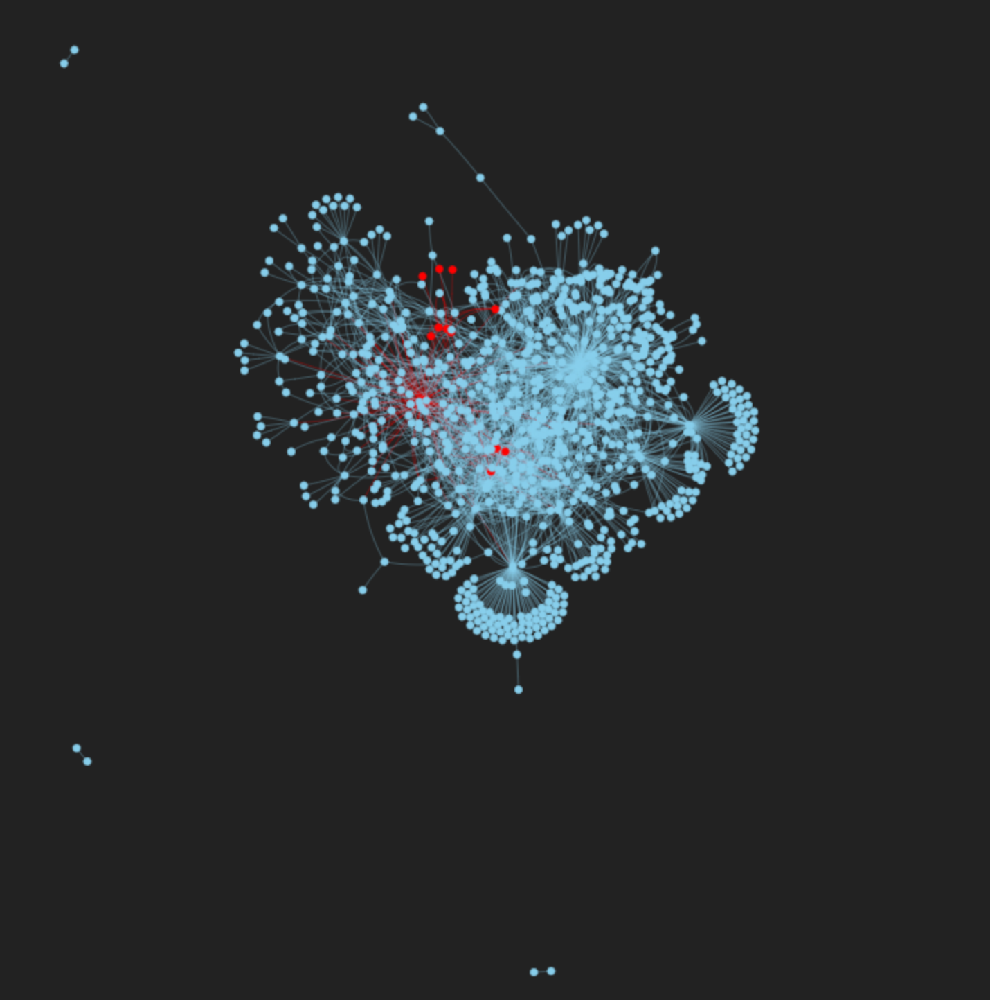

# Core Fringe Partition

We implement a core-fringe partitioning algorithm for graph analysis, specifically targeting network security. For this study, we utilize the CTU-13 dataset from the Stratosphere IPS project[^1].

The entry point of the program is `main.rs`.

## Usage

First, install the dependencies.

```bash
cd viz
python -m venv .venv
pip install -r requirements.txt
```

Then, run the program.

```bash
cargo run (-- release) -- <file_path>
```

You can visualize the graph using the `viz` directory.

```bash
python visualize.py
```

## Example

```bash
cargo run --release -- dataset/icmp_ddos.binetflow
```


## Details

### Dataset
The dataset is part of the CTU-13 collection, which consists of botnet traffic captured at CTU University, Czech Republic, in 2011. The objective of this dataset was to provide a large-scale capture of real botnet traffic mixed with normal and background traffic. In this implementation, we focus on the ICMP DDoS attack scenario.

Core nodes are likely those acting as botnet controllers or targets of the attack. We can distinguish the node types based on their labels. In `main.rs`, we utilize `GraphBuilder` to construct a graph from the `binetflow` data. The dataset includes columns such as:

- StartTime, Dur, Proto, SrcAddr, Sport, Dir, DstAddr, Dport, State, sTos, dTos, TotPkts, TotBytes, SrcBytes, Label

We use **SrcAddr** and **DstAddr** as nodes, and **Label** as the edge label.

As shown in Figure 1, the resulting graph consists of **41,931 nodes** and **107,251 edges, where the red nodes represent** Botnets and the others do Normal or Background nodes.




## k-core algorithm[^2]

We compute the k-core of the graph. A k-core is the maximal subgraph in which all nodes have a degree of at least k. The algorithm proceeds as follows :

1. Initialize the core number of each node to 0.
2. For each node, if its degree is at least k, set its core number to k and add it to the k-core.
3. For each node, if its degree is less than k, remove it from the graph.
4. Repeat steps 2 and 3 until no more nodes are removed.
5. Return the k-core.

By calculating the k-core, we can separate core nodes from fringe nodes.

### Time complexity $O(m+n)$
We employ bucket sort to order the nodes by their degree. During initialization, we determine the maximum degree of the graph to set up the buckets and scan all nodes. Each node is processed exactly once to determine its core number. Furthermore, each edge is inspected exactly once or twice to update the core number of each node (if the graph is directed, we look at each edge once, if the graph is undirected, we look at each edge twice).

Hence, the time complexity is $O(n + m)$ , where $n$ is the number of nodes and $m$ is the number of edges.

### Space complexity $O(m+n)$
- adjacency list $O(m+n)$
- degree array $O(n)$
- bucket array $O(m+n)$
Hence, the space complexity is $O(m+n)$, where n is the number of nodes and m is the number of edges.


## Experimental results

Below are the top 20 core-scored nodes by the k-core calculation in the ICMP DDoS attack scenario. The network was modeled as an undirected graph.

```
Total lines processed: 107252
Graph built: 41931 nodes
Max Core Number: 14719

--- Top Core Nodes Analysis ---
Core: 14719 | IP: 147.32.80.9     | Label: flow=From-Botnet-V52-1-UDP-DNS
Core: 14719 | IP: 147.32.84.138   | Label: flow=To-Background-UDP-CVUT-DNS-Server
Core: 4387 | IP: 147.32.96.69    | Label: flow=From-Botnet-V52-2-ICMP
Core: 4387 | IP: 147.32.84.165   | Label: flow=From-Botnet-V52-1-UDP-DNS
Core: 4304 | IP: 147.32.84.59    | Label: flow=Background-Established-cmpgw-CVUT
Core: 4246 | IP: 147.32.84.191   | Label: flow=From-Botnet-V52-2-UDP-DNS
Core: 2563 | IP: 147.32.85.25    | Label: flow=To-Background-UDP-CVUT-DNS-Server
Core: 2109 | IP: 147.32.84.164   | Label: flow=From-Normal-V52-Grill
Core: 1479 | IP: 147.32.85.34    | Label: flow=Background
Core: 892 | IP: 147.32.85.7     | Label: flow=Background-google-analytics12
Core: 689 | IP: 147.32.86.20    | Label: flow=To-Background-UDP-CVUT-DNS-Server
Core: 568 | IP: 76.13.114.90    | Label: flow=Background-Established-cmpgw-CVUT
Core: 561 | IP: 147.32.84.189   | Label: flow=Background
Core: 478 | IP: 147.32.80.13    | Label: flow=From-Background-CVUT-Proxy
Core: 478 | IP: 147.32.84.94    | Label: flow=Background-UDP-Established
Core: 372 | IP: 147.32.84.170   | Label: flow=To-Background-Stribrek
Core: 366 | IP: 147.32.86.122   | Label: flow=To-Background-UDP-CVUT-DNS-Server
Core: 322 | IP: 188.138.84.239  | Label: flow=Background-TCP-Established
Core: 311 | IP: 147.32.86.135   | Label: flow=Background
Core: 280 | IP: 147.32.84.118   | Label: flow=Background-TCP-Attempt
```

[^1]: Garcia, Sebastian. Malware Capture Facility Project. Retrieved from https://stratosphereips.org

[^2]: Matula, D. W., & Beck, L. L. (1983). Smallest-last ordering and clustering and graph coloring algorithms. Journal of the ACM (JACM), 30(3), 417-427.